<div align="center">

# 💪 FitLife

### A complete sports & nutrition coaching platform

Mobile app for clients, coaches and nutritionists, plus a web dashboard for administrators.


</div>

---

## 📖 Table of Contents

- [About the project](#-about-the-project)
- [Features](#-features)
- [Screenshots](#-screenshots)
- [Architecture](#-architecture)
- [Diagrams](#-diagrams)
- [Tech stack](#-tech-stack)
- [Getting started](#-getting-started)
- [Deployment](#-deployment)
- [Roadmap](#-roadmap)

---

## 🎯 About the project

**FitLife** is a full-stack platform for planning and tracking workouts and nutrition. It was designed and built during an engineering internship at **Catalyze Teck** (ESPRIT, 2024/2025).

Existing apps such as MyFitnessPal or Nike Training Club lock advanced options behind paid plans and give administrators no complete management dashboard. They also lack mobile/web synchronization and analysis tools for coaches. FitLife answers these limits with two interfaces:

| Interface | Built with | For |
|-----------|-----------|-----|
| 📱 **Mobile app** | React Native | Clients, coaches and nutritionists |
| 🖥️ **Web dashboard** | React.js | Administrators only |

Both talk to one **Node.js / Express** API backed by **MongoDB**.

---

## ✨ Features

### 👤 Client
- Follow workout programs and sessions
- Track progress (weight, measurements, BMI, BMR)
- Consult nutrition plans (meals, foods, macros)
- Find nearby gyms on a map
- Browse the product catalog (supplements, sports equipment), with favorites and cart
- Contact coaches and nutritionists, view their profiles, request a consultation and leave feedback

### 🏋️ Coach & 🥗 Nutritionist
- Manage a professional profile (certifications, specialties, availability, hourly rate)
- Reply to client messages
- Manage follow-up and consultation requests
- Create training programs / meal plans for clients

### 🛠️ Administrator (web dashboard)
- Manage administrators, coaches, nutritionists and clients
- Manage the sport & nutrition catalog
- Gym map
- Global statistics and activity charts

### 🔐 Common
- Secure authentication, password reset, role-based access (client, coach, nutritionist, admin)

---

## 📸 Screenshots

### Web dashboard (admin)

<p align="center">
  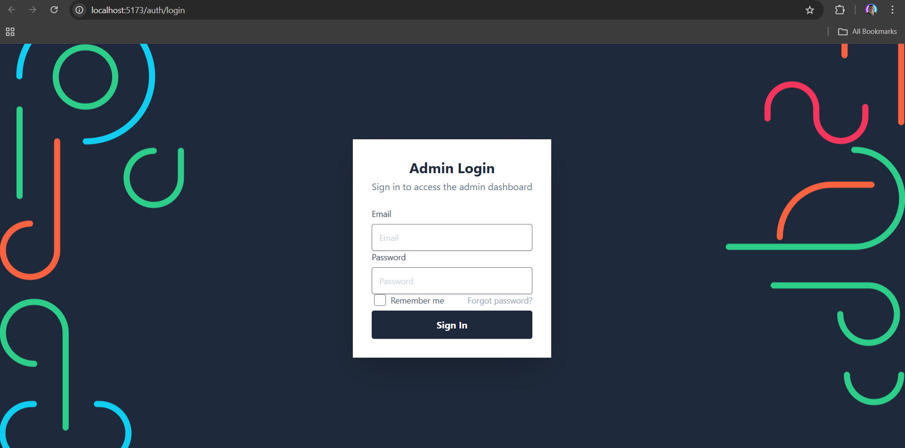
  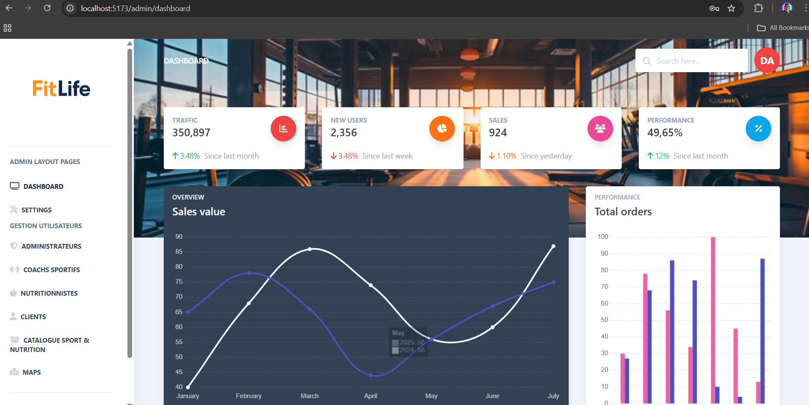
</p>

### Mobile app

<p align="center">
  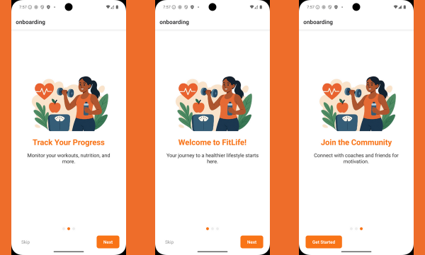
  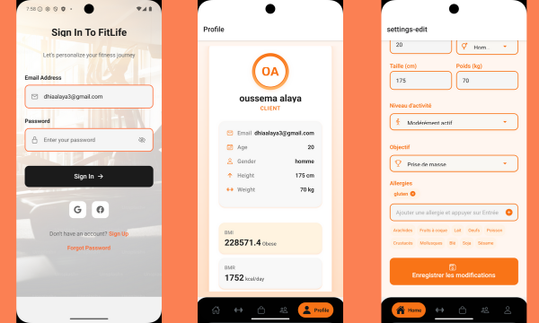
</p>

<p align="center">
  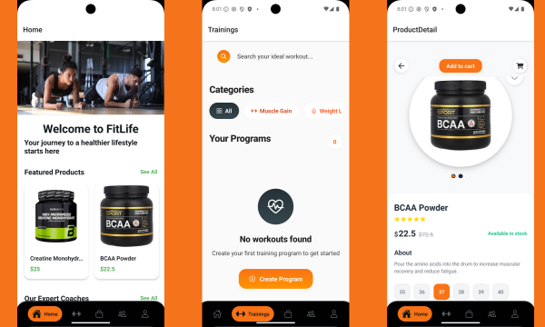
</p>

---

## 🏗️ Architecture

<p align="center">
  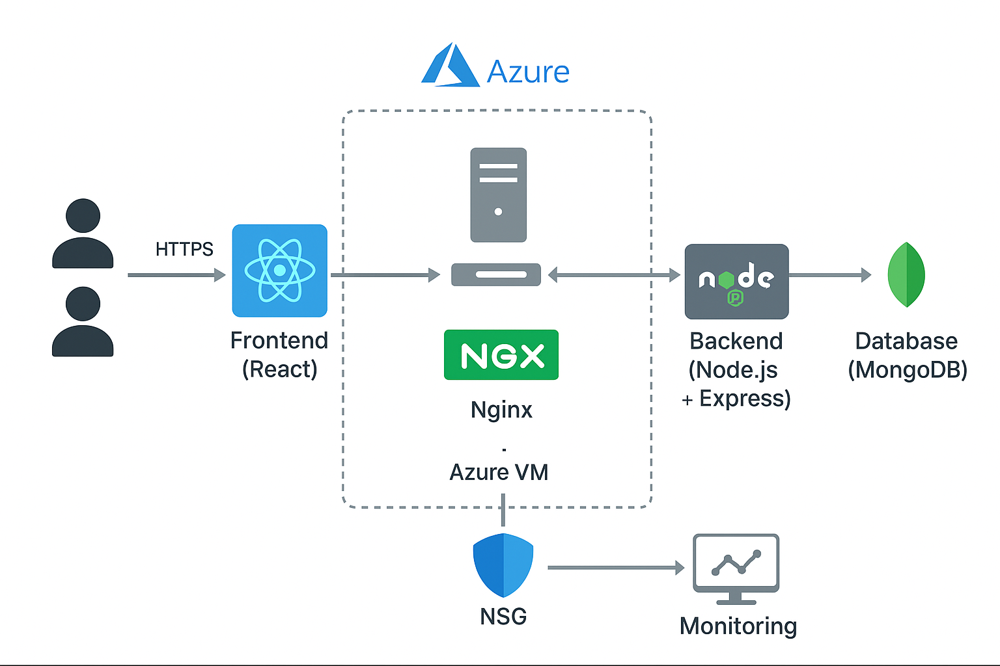
</p>

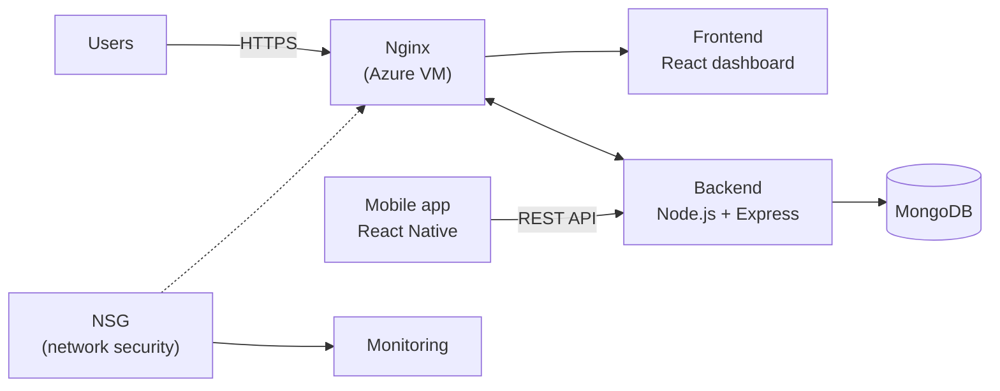

---

## 📐 Diagrams

### Use case diagram

<p align="center">
  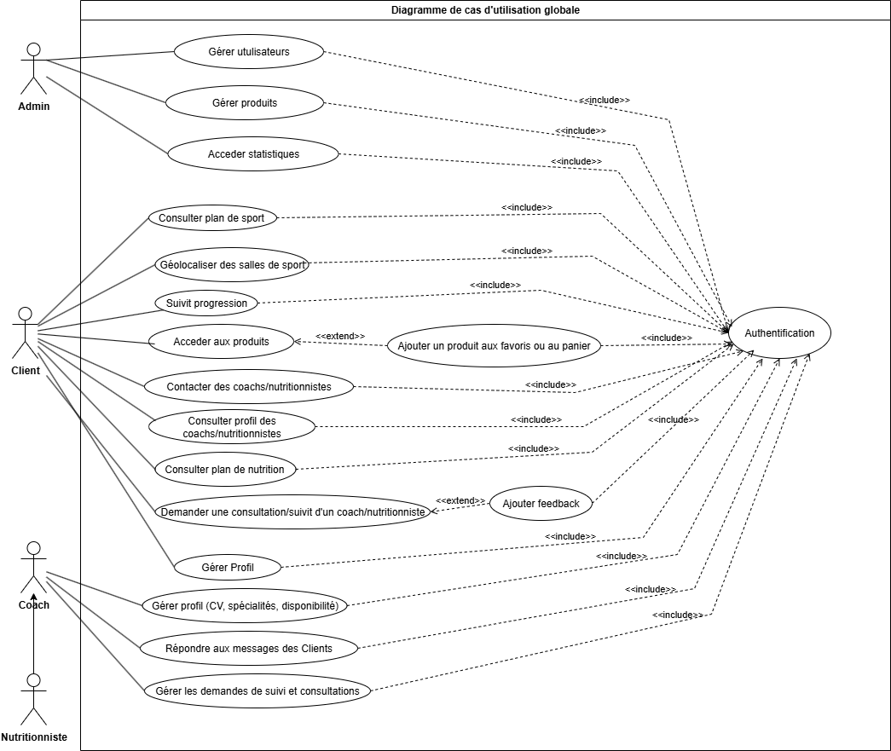
</p>

### Use cases by role (simplified)

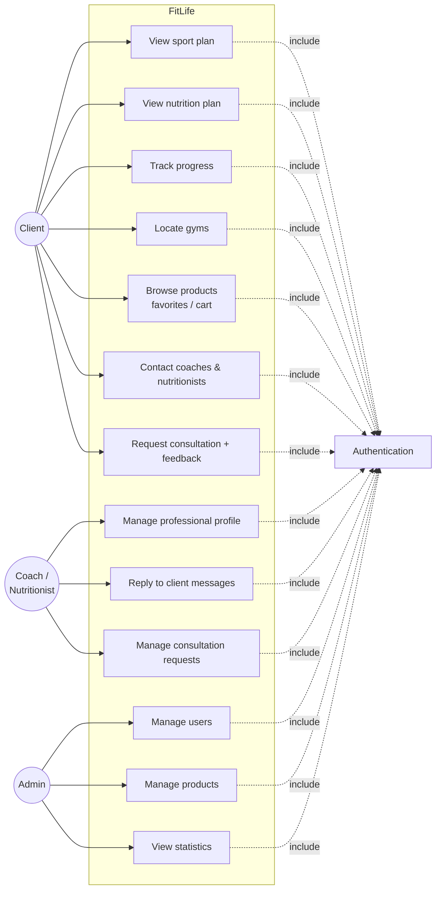

### Authentication flow

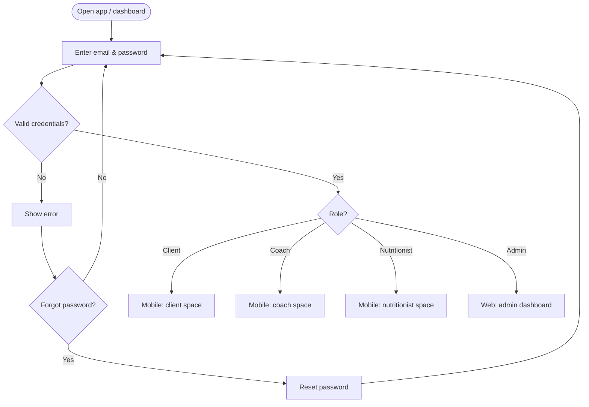

### Consultation flow

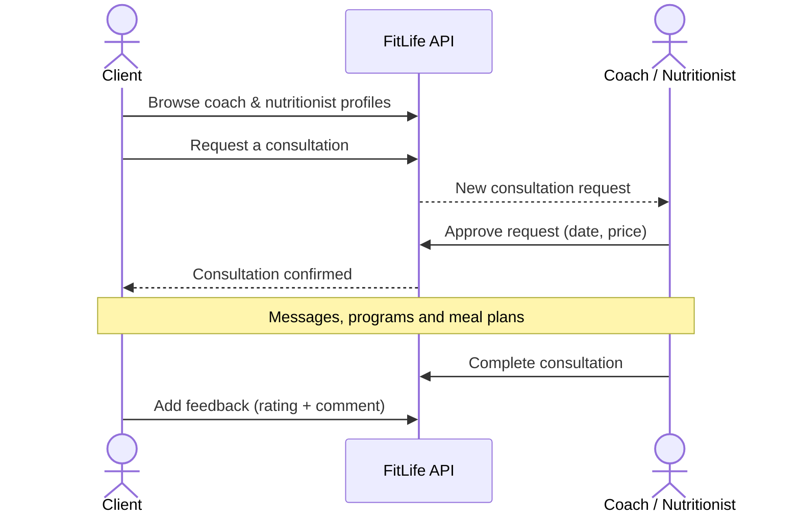

### Workout session flow

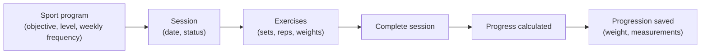

### Class diagram

<p align="center">
  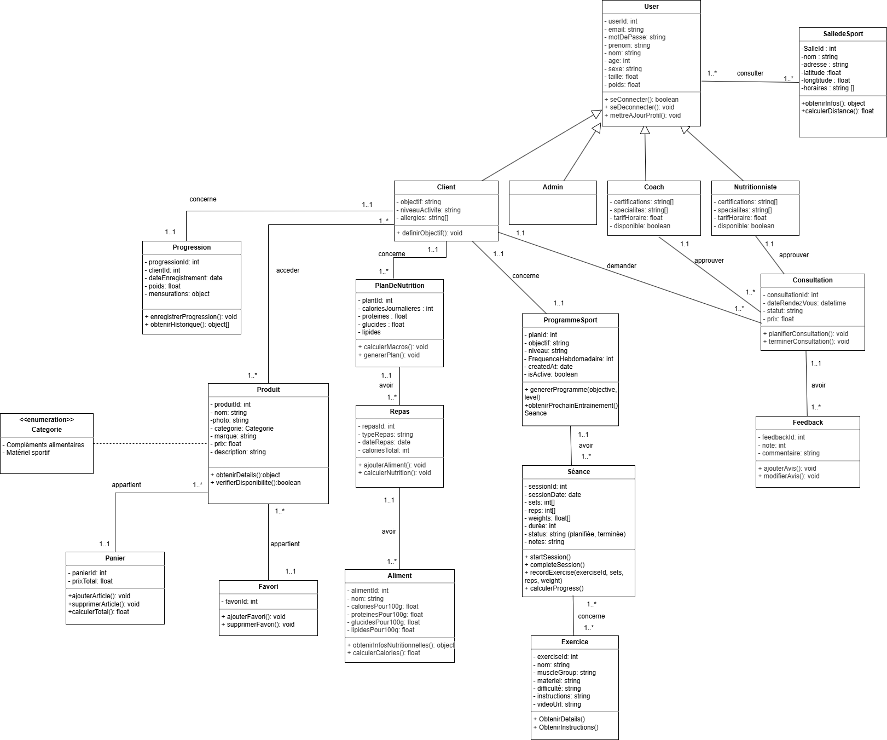
</p>

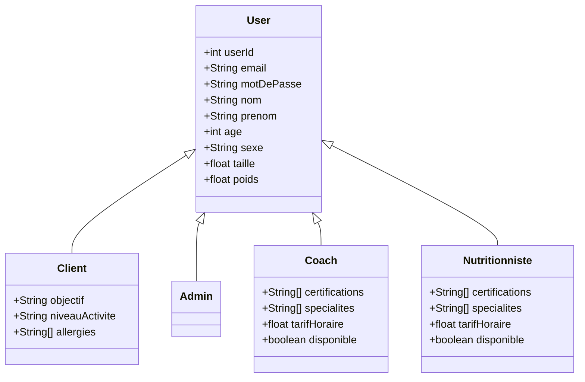

### Entity-relationship diagram

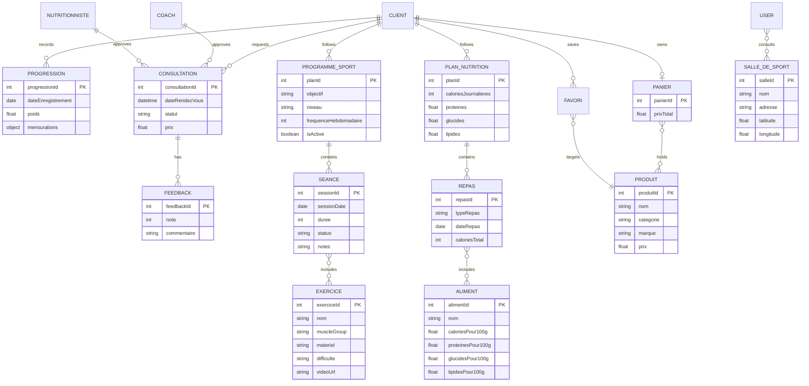

---

## 🧰 Tech stack

| Layer | Technology |
|-------|-----------|
| Mobile app | React Native |
| Web dashboard | React.js |
| Backend / API | Node.js, Express.js |
| Database | MongoDB |
| Cloud & hosting | Azure Virtual Machine (Linux), Nginx, NSG, monitoring |
| Tools | Git & GitHub, Postman, Figma, draw.io |

---

## 🚀 Getting started

<!-- TODO: adapt folder names and commands to your repository. -->

### Prerequisites

- Node.js 18+ and npm
- MongoDB (local or Atlas)
- Android Studio / Xcode, or a physical device, for the mobile app

### Installation

```bash
# 1. Clone the repository
git clone https://github.com/<your-username>/fitlife.git
cd fitlife

# 2. Backend
cd backend
npm install
cp .env.example .env      # set your MongoDB URI, JWT secret, ...
npm run dev

# 3. Admin dashboard (web)
cd ../dashboard
npm install
npm run dev               # http://localhost:5173

# 4. Mobile app
cd ../mobile
npm install
npx react-native run-android
```

### Environment variables (example)

```env
PORT=5000
MONGO_URI=mongodb://localhost:27017/fitlife
JWT_SECRET=change_me
```

---

## ☁️ Deployment

FitLife is deployed on an **Azure Virtual Machine** (Linux, B2s v2: 2 vCPU, 8 GB RAM):

- **Nginx** serves the React dashboard and acts as the entry point over HTTPS
- The **Node.js / Express** backend runs on the same VM and connects to **MongoDB**
- An Azure **Network Security Group (NSG)** restricts network access
- **Monitoring** follows the health of the VM

---

## 🗺️ Roadmap

- 🤖 AI-based workout recommendations
- 🥗 AI-personalized nutrition plans
- 📊 Advanced analytics for coaches
- 🎨 More personalization options

---

<div align="center">

**FitLife** · Train smarter, eat better 🚀

</div>
